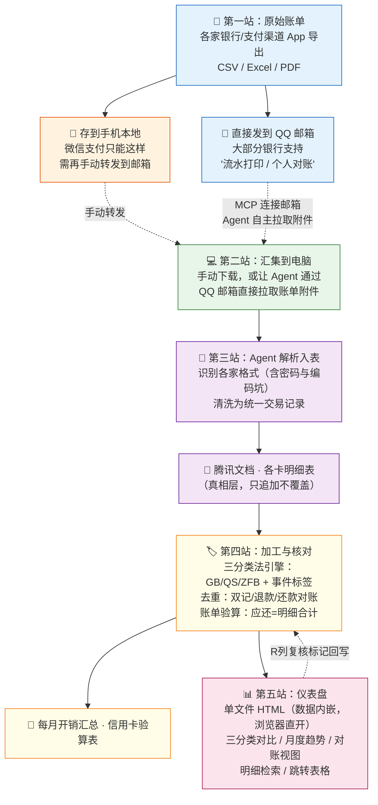
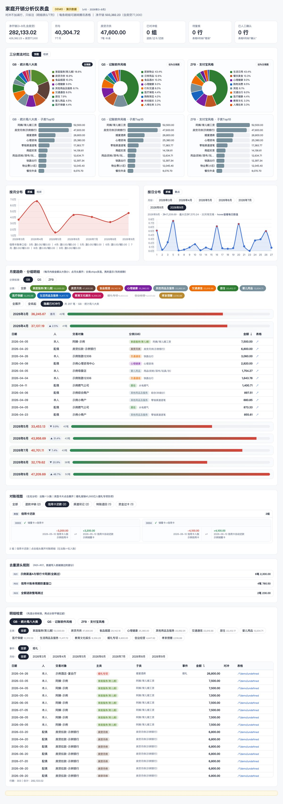

# Family Expense Skills · 家庭开销管理技能组

一组 [WorkBuddy](https://www.workbuddy.cn) 技能，管理"多源账单 → 腾讯文档总表 → 单文件仪表盘"的家庭财务数据管线。

> ⚠️ **本仓库不含任何真实数据**：所有示例均为占位符（`YOUR_FILE_ID`/`父亲`/`示例商户`…），演示数据见 `expense-dashboard/assets/demo_data.json`（随机生成的假数据）。接入你自己的账单即可得到真实结果。

## 数据是怎么流动的

每月月初对 Agent 说一句"**更新家庭资产表**"，即可走完 收账单 → 解析 → 分类 → 对账 → 出仪表盘 全流程。

## 数据来源清单（怎么把账单弄出来）

| 渠道 | 导出方式 | 到 Agent 手里的路径 |
|---|---|---|
| 招商银行（储蓄卡） | App → 流水打印 → 发邮箱（zip 密码在 App 申请记录里查） | 邮箱直拉 |
| 招商银行（信用卡） | 支持每月自动发账单到邮箱；也可手动导出 | 邮箱直拉 |
| 中信银行 | App 导出流水（PDF/Excel） | 邮箱或手动 |
| 农业银行 | App 导出（AES 加密 zip，密码自设） | 手动下载解压 |
| 中国银行 | App 导出流水（PDF 密码） | 邮箱或手动 |
| 汇丰中国/香港 | 电子对账单/电子账单（PDF 密码） | 邮箱直拉 |
| 部分银行信用卡 | **支持自动每月发账单到邮箱**（设置一次长期有效） | 邮箱直拉 |
| 支付宝 | 我的 → 账单 → 交易流水证明 → 发邮箱（CSV，GBK 编码） | 邮箱直拉或本地文件 |
| 微信支付 | 我 → 服务 → 钱包 → 账单 → 账单下载（**只能存手机，需手动转发到邮箱**） | 手机 → 转发邮箱 → Agent 拉取 |

**通用规律**：储蓄卡和信用卡基本都有"流水打印 / 个人对账单 → 发邮箱"功能；微信支付是唯一不能直接发邮箱的，多一步手动转发；信用卡还普遍支持订阅制月账单自动投递，配一次一劳永逸。

## 技能组成

| Skill | 职责 |
|---|---|
| **family-expense-hub** | 总入口：流程路由 + 月度更新 + 铁律（含 sheet-map.md 表结构模板） |
| **bill-source-parsing** | 解析账单源（招行/中信/农行/中行/汇丰/eml/微信/支付宝），含各家格式坑 |
| **dedup-reconciliation** | 三类去重 + 对账台账（退款配对/还款对账/渠道银行双记） |
| **multi-scheme-classify** | 三分类法引擎（GB统计局八大类/QS记账软件/ZFB支付宝）+ 自定义类别三种方式 |
| **tencent-sheet-sync** | 腾讯文档读写规范 + 下拉验证 + 工具坑 |
| **expense-dashboard** | Chart.js 单文件仪表盘（三分类对比/对账视图/月度分组） |

## 快速开始

1. 安装 WorkBuddy，将本仓库各技能目录放入 `~/.workbuddy/skills/`
2. 建你自己的腾讯文档表格（结构照 family-expense-hub/references/sheet-map.md，把 `YOUR_FILE_ID` 换成你的）
3. 对 WorkBuddy 说"更新家庭资产表"即触发 family-expense-hub 分派

## 核心方法论

- **明细即真相**：禁止汇总行；信用卡账单逐笔按交易日期归月
- **对冲不加行**：S/T 列标注 + 左右对称对账台账（出账⇄入账）
- **三分类法**：每笔同挂 GB/QS/ZFB 三套 + 多事件标签（如"高铁=交通+婚礼"）
- **防重体系**：渠道↔银行双记跳过、退款配对、同日同额去重，全程可审计

## Demo

**在线演示**：https://stupidism.github.io/family-expense-skills/ （GitHub Pages，随机假数据）

截图对应的数据与说明

`expense-dashboard/assets/demo_data.json` 为随机假数据（303 条，2026年3-9月），结构与真实数据完全一致——三分类法、对账台账、去重规则、月度分组等仪表盘全部功能均可演示。`docs/index.html` 为用该数据渲染的完整单文件仪表盘（Chart.js 内嵌，本地双击也能打开）。

---
Made with WorkBuddy
